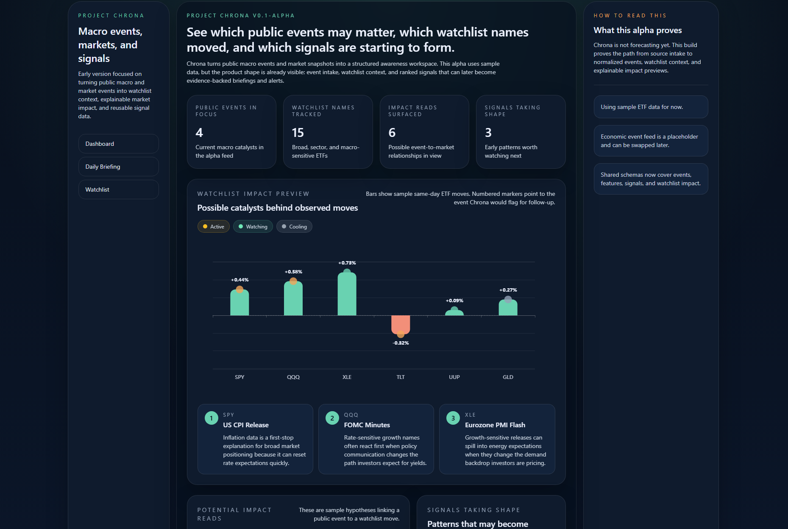
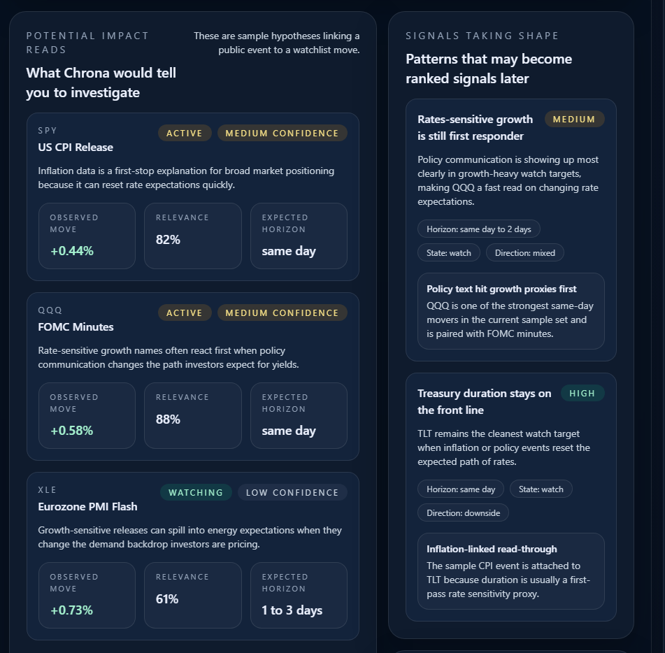

# Project Chrona

Macro Intelligence Research Terminal

## Overview

Project Chrona is a portfolio research project exploring structured macro and market context modeling.

It is a time-aware system that ingests public macroeconomic, financial, and event-driven data and transforms it into structured, scored context for daily and intraday awareness.

Chrona is not a production trading system. It is an architecture-first experiment in modeling how public signals relate to instruments, catalysts, and recurring market behavior.

The goal is to explore whether structured macro context can be made operationally useful before attempting predictive forecasting.





## Positioning

Chrona is not:
- an execution engine
- an automated trading system
- a retail signal feed
- a scraping experiment

Chrona is:
- a temporal signal modeling experiment
- a structured catalyst mapping system
- a macro briefing generator
- a research prototype for contextual market reasoning

## Current Functionality

The current repository represents an early alpha architecture focused on:
- ingesting fixture-backed macro calendar and market price data
- normalizing events, instruments, impacts, features, and signals through shared schemas
- exposing API routes for health, events, instruments, and briefing data
- rendering a UI for watchlist impact preview and signal scaffolding
- supporting background worker infrastructure for ingestion-oriented flows

At present, Chrona operates primarily on local fixture data and is designed to test structure, not to deliver production-grade forecasting.

## System Framing

Chrona ingests public macro and market signals and transforms them into structured event and instrument models.

From those models, it computes reusable features and assembles scored views that can support:
- daily briefings
- intraday change detection
- catalyst-to-watchlist mapping
- persistent contextual memory across events and instruments

The emphasis is on explainable structure and reusable reasoning primitives rather than automated execution.

## Architecture

Chrona is organized as a small monorepo:
- `apps/api` - Fastify API exposing health, events, instruments, and briefing endpoints
- `apps/ui` - Next.js interface for dashboard and watchlist impact views
- `apps/workers` - background ingestion and processing workers
- `packages/core-schema` - shared schemas and domain types
- `packages/connectors` - source connectors for macro calendar and price inputs
- `packages/source-registry` - registry definitions for data sources
- `packages/db` - database defaults and migration references

The project prioritizes schema clarity and separation of concerns to support future experimentation.

## Tech Stack

**Frontend**
- Next.js
- React
- TypeScript
- Tailwind CSS
- ECharts

**Backend**
- Node.js
- Fastify
- TypeScript

**Workers**
- BullMQ
- Redis

**Data / Schema**
- PostgreSQL-oriented local infra
- Shared typed schemas with Zod
- Structured event, instrument, impact, feature, and signal models

**Tooling**
- pnpm workspaces
- Turborepo
- Docker Compose

## Intended Direction

Chrona is being developed as a research platform for:
- structured macro and market briefings
- intraday awareness updates
- catalyst scoring experimentation
- persistent memory across signals and instruments

If the modeling approach proves useful, it may evolve into a usable intelligence tool.

For now, it remains a systems and research build focused on exploring macro context modeling and explainable signal generation.

## Status

Active development.

Current state:
- architecture-first monorepo
- fixture-backed connectors
- API, UI, and worker scaffolding in place
- early signal and impact views implemented
- forecasting and model-driven ranking not yet production-grade

## Development

Workspace tooling:
- package manager: `pnpm`
- task runner: `turbo`

Common commands:

```bash
pnpm install
pnpm build
pnpm lint
pnpm test
pnpm dev
```

## Notes

Project Chrona is a personal portfolio and research build exploring structured macro intelligence infrastructure.

It is intended to demonstrate systems design, typed schema modeling, ingestion pipelines, and explainable signal scaffolding - with the possibility of evolving into a practical tool if the underlying approach proves valuable.
